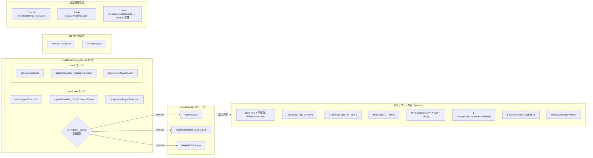

# ADR-0006: Claude Code settings.json の管理方針

## ステータス

Accepted

## コンテキスト

Claude Code のユーザースコープ設定（`~/.claude/settings.json`）を dotfiles で管理したい。
設定には permissions / hooks / plugins / marketplaces / language が含まれる。personal/work で異なる構成が必要。
また Claude Code の権限設定は誤設定によりセキュリティリスクが生じるため、方針を明文化する。

### 要件

- personal/work モードで設定を切り替えられること（既存の `DOTFILES_MODE` パターンに準拠）
- git で管理・バージョン管理できること
- 機密ファイル（`.env`, 秘密鍵, AWS 認証情報等）を Claude Code が読み取れないようにすること
- リポジトリ削除などの破壊的操作を Claude Code が実行できないようにすること

## 検討した選択肢

### 選択肢 1: template 方式（実体は install スクリプトで生成）

- `src/.claude/settings.template.json` を git 管理
- install 時にテンプレートを展開して `~/.claude/settings.json` を生成

### 選択肢 2: symlink 方式（既存パターン踏襲）

- `src/.claude/settings.{personal|work}.json` を git 管理
- `DOTFILES_MODE` に応じて `~/.claude/settings.json` へ symlink を作成

### 選択肢 3: User/Project/Local スコープを完全分離

- User スコープ（`~/.claude/settings.json`）は language/hooks/plugins のみ
- 権限設定は各プロジェクトの `.claude/settings.json` に委譲

## 決定

**選択肢 2: symlink 方式** を採用する。

## 理由

| 観点 | 選択肢 1 | 選択肢 2 | 選択肢 3 |
| ---- | -------- | -------- | -------- |
| 既存パターンとの一貫性 | ❌ 新規パターン導入 | ✅ gitconfig/mise と同一 | ❌ 各 repo に設定が必要 |
| personal/work 切替 | △ テンプレート変数で対応可 | ✅ ファイル分離で明確 | ❌ 対応不可 |
| git での差分管理 | ❌ 生成ファイルは追跡不可 | ✅ 直接追跡可能 | ✅ 追跡可能 |
| machine-specific 差分 | ❌ 分離できない | ✅ `.claude/settings.local.json` で吸収 | ✅ 同上 |

### 主な決定理由

1. **既存パターンとの一貫性**: gitconfig, mise config で実績のある symlink 切替方式を踏襲することで、install/uninstall/status/doctor の実装コストが低い
2. **personal/work の明確な分離**: ファイルを分けることで diff が見やすく、誤って混在させるリスクが低い
3. **template 方式は不要な複雑性**: dotfiles repo の用途は個人設定管理であり、チーム展開を想定した template 生成は過剰

## 結果

### 全体像


<!-- Mermaid data source for the drawio diagram above -->



### ファイル構成

```text
src/.claude/
├── settings.personal.json     # personal モード用設定（git 管理）
├── settings.work.json         # work モード用設定（git 管理）
└── plugins/
    ├── installed_plugins.personal.json
    ├── installed_plugins.work.json
    ├── config.personal.json
    └── config.work.json
```

### symlink マッピング

`DOTFILES_MODE` に応じて以下の symlink を作成:

| Source | Target |
| ------ | ------ |
| `src/.claude/settings.{mode}.json` | `~/.claude/settings.json` |
| `src/.claude/plugins/installed_plugins.{mode}.json` | `~/.claude/plugins/installed_plugins.json` |
| `src/.claude/plugins/config.{mode}.json` | `~/.claude/plugins/config.json` |

### セキュリティ方針: deny-first

`allow` リストは使用しない。`defaultMode: plan` のもと必要なコマンドは都度確認を経て実行する。
`deny` に以下を必ず含める:

| カテゴリ | deny パターン |
| -------- | ------------- |
| 破壊的 GitHub 操作 | `Bash(gh repo delete:*)` |
| 一括 git add | `Bash(git add -A:*)`, `Bash(git add --all:*)`, `Bash(git add .)` |
| 環境変数ファイル | `Read(.env)`, `Read(.env.*)` |
| シークレットディレクトリ | `Read(secrets/**)` |
| 鍵ファイル | `Read(**/*.pem)`, `Read(**/*.key)` |
| AWS 認証情報 | `Read(//Users/*/.aws/credentials)`, `Read(//Users/*/.aws/config)` |
| SSH 秘密鍵 | `Read(//Users/*/.ssh/id_*)`, `Read(//Users/*/.ssh/*.pem)` |
| netrc | `Read(//Users/*/.netrc)` |

### git 管理対象外

```gitignore
src/.claude.json          # Claude Code のグローバルメタデータ
.claude/settings.local.json  # machine-specific な個人 override
```

### 注意事項

- `allow` リストの追加は慎重に行う。`gh api:*` や `cat:*` のようなワイルドカードは機密ファイルへのアクセスや破壊的 API 呼び出しを許可してしまう
- `settings.local.json` は `.gitignore` 済みのため、machine-specific な設定や一時的な権限緩和はそちらで行う
- 絶対パスの deny パターンは `//` プレフィックスで指定する（例: `Read(//Users/*/.aws/credentials)`）
