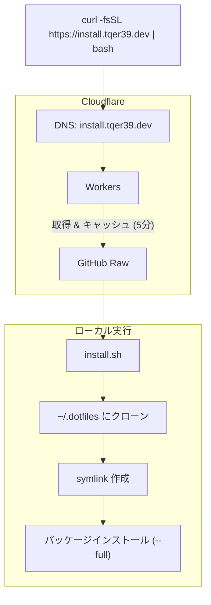

# アーキテクチャ

[🇺🇸 English](./architecture.md)

## インストールフロー

## エントリーポイント

- `install.sh` - Unix (macOS/Linux) エントリーポイント、curl からパイプ可能
- `install.ps1` - Windows PowerShell エントリーポイント

## スクリプトライブラリ (`scripts/lib/`)

すべてのスクリプトから読み込まれる共通ユーティリティ:

- `log.sh` - カラー付きログ関数 (`log_info`, `log_success`, `log_error` など)
- `utils.sh` - OS 検出 (`detect_os`)、パス展開、コマンドチェック
- `symlink.sh` - バックアップ機能付き冪等シンボリックリンク作成

## 設定

- `config/platform-files.conf` - SOURCE:DESTINATION:PLATFORMS マッピングを定義
  - フォーマット: `.zshrc:~/.zshrc:macos,linux`
  - プラットフォーム: `all` / `macos` / `linux` / `ubuntu` / `windows`
- `config/packages/Brewfile` - Homebrew パッケージ
- `config/packages/apt-packages.txt` - Ubuntu 用 APT パッケージ

## インストーラー (`scripts/installers/`)

`--full` インストール時に呼び出されるモジュラーインストーラー:

- `homebrew.sh` - Homebrew と Brewfile パッケージ
- `apt.sh` - APT パッケージ (Ubuntu のみ)
- `anyenv.sh` - 言語ランタイムマネージャー
- `vscode.sh` - `src/.vscode/extensions.json` の VS Code 拡張機能

## インフラストラクチャ

### ドメイン & DNS

- **ドメイン**: `tqer39.dev` (Google Cloud Platform で登録)
- **DNS/CDN**: Cloudflare
  - `tqer39.dev` のゾーン管理
  - `install.tqer39.dev` リダイレクト用 Workers

### CI/CD

- **GitHub Actions** + AWS IAM OIDC (API キー不要)
- **State Backend**: AWS S3

### Terraform (`infra/terraform/`)

- `modules/` - 再利用可能なモジュール
  - `cloudflare/` - CloudFlare DNS 設定
  - `workers/` - CloudFlare Workers デプロイ
  - `deploy-role/` - GitHub Actions OIDC 用 IAM Role
- `envs/prod/` - 本番環境
  - `bootstrap/` - IAM Role (最初にローカル実行必須)
  - `dns/` - CloudFlare DNS レコードと Workers
