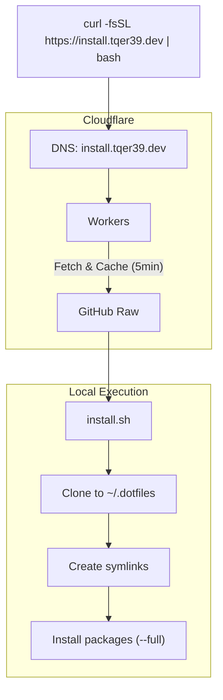

# Architecture

[🇯🇵 日本語版](./architecture.ja.md)

## Installation Flow

## Entry Points

- `install.sh` - Unix (macOS/Linux) entry point, can be piped from curl
- `install.ps1` - Windows PowerShell entry point

## Script Library (`scripts/lib/`)

Shared utilities sourced by all scripts:

- `log.sh` - Colored logging functions (`log_info`, `log_success`, `log_error`, etc.)
- `utils.sh` - OS detection (`detect_os`), path expansion, command checking
- `symlink.sh` - Idempotent symlink creation with backup support

## Configuration

- `config/platform-files.conf` - Defines SOURCE:DESTINATION:PLATFORMS mappings
  - Format: `.zshrc:~/.zshrc:macos,linux`
  - Platforms: `all` / `macos` / `linux` / `ubuntu` / `windows`
- `config/packages/Brewfile` - Homebrew packages
- `config/packages/apt-packages.txt` - APT packages for Ubuntu

## Installers (`scripts/installers/`)

Modular installers called during `--full` installation:

- `homebrew.sh` - Homebrew and Brewfile packages
- `apt.sh` - APT packages (Ubuntu only)
- `anyenv.sh` - Language runtime manager
- `vscode.sh` - VS Code extensions from `src/.vscode/extensions.json`

## Infrastructure

### Domain & DNS

- **Domain**: `tqer39.dev` (registered via Google Cloud Platform)
- **DNS/CDN**: Cloudflare
  - Zone management for `tqer39.dev`
  - Workers for `install.tqer39.dev` redirect

### CI/CD

- **GitHub Actions** with AWS IAM OIDC (no API keys stored)
- **State Backend**: AWS S3

### Terraform (`infra/terraform/`)

- `modules/` - Reusable modules
  - `cloudflare/` - CloudFlare DNS configuration
  - `workers/` - CloudFlare Workers deployment
  - `deploy-role/` - IAM Role for GitHub Actions OIDC
- `envs/prod/` - Production environment
  - `bootstrap/` - IAM Role (must be run locally first)
  - `dns/` - CloudFlare DNS records and Workers
