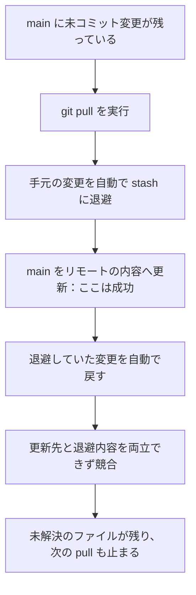
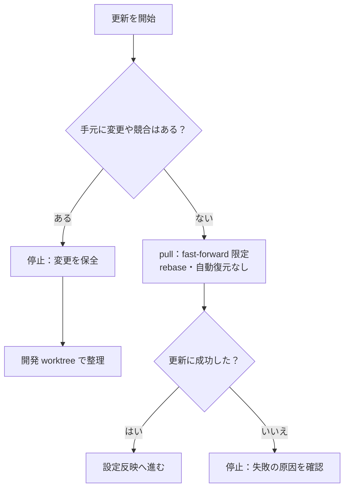
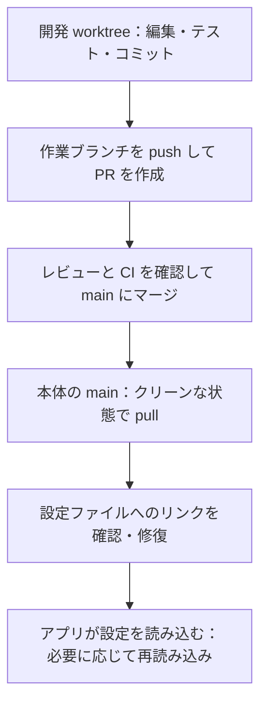

# PR #588 の原因と対策：dotfiles を安全に更新する

[PR #588](https://github.com/tqer39/dotfiles/pull/588) は、
環境反映用の `~/.dotfiles` にローカル変更を自動で戻す処理をやめ、
変更を検出したら更新を止める修正です。

開発は別の worktree で進め、PR のマージ後に `~/.dotfiles` の `main` を更新します。
競合を自動で解決する機能や、ローカル変更を自動で捨てる機能は追加しません。

## 1. main にコミットしていないのに、なぜ競合するのか

**コミットしていなくても、手元のファイルに変更があれば競合する可能性があります。**

| 言葉 | この資料での意味 |
| --- | --- |
| ローカル変更 | 編集済みだが、まだコミットしていない内容。ステージ済みの変更や未追跡ファイルも含みます。 |
| stash | ローカル変更を一時的に保管する Git の機能です。 |
| autostash | 更新前に自動で退避し、更新後に自動で戻す仕組みです。 |
| fast-forward | 手元の履歴を、取り込み先のコミットまでそのまま進める更新です。新しいマージコミットは作りません。 |
| クリーン | この更新処理では、未コミット変更・未追跡ファイル・未解決の競合がない状態です。Git の除外対象は含みません。 |

調査時の `main` には、以前の未コミット変更が残っていました。
また、通常の `git pull` に `pull.rebase=true` と `rebase.autoStash=true` が適用されていました。
履歴には fast-forward の成功が記録され、その直後の自動 stash 復元で
`tests/test-karabiner.py` に競合が残っていました。

### 図1：今回、通常の git pull で起きた流れ

たとえば、同じ設定箇所を GitHub 側では「新しい設定」、手元では「個別の設定」に変えていた場合です。
更新後に手元の変更を戻そうとしても、Git にはどちらを採用すべきか判断できないことがあります。
これは仕組みを説明する例であり、実際のキー設定の値ではありません。

開発用 worktree を使う運用でも、以前の変更が本体に残っていれば、この問題は起きます。
また、ホームの設定ファイルは `~/.dotfiles/src/` へのシンボリックリンクになっている場合があります。
そのリンクを経由した編集は、本体の `src/` の変更になります。
今回残っていた変更を、誰がどの操作で作ったかまでは、この調査では特定していません。

## 2. PR は何を変えるのか

通常の `git pull` と、インストーラー内部の更新処理は別の経路です。
旧インストーラーも、自分で stash を作り、更新後に復元していました。
このため、Git の autostash 設定を無効にするだけでは、旧インストーラーの復元処理は止まりません。

| 操作 | 変更前 | PR #588 の変更後 |
| --- | --- | --- |
| ローカル変更がある状態でインストーラーを実行 | stash へ退避して更新し、変更を戻します。 | **更新前に停止します。ファイルの変更や stash の作成・復元はしません。** |
| 復元で競合した場合 | stash を残し、`reset --hard HEAD` で更新後の追跡ファイルへ戻します。 | 復元処理自体を廃止します。この後始末も不要になります。 |
| 作業ツリーがクリーンな場合 | `pull --ff-only` を実行します。 | `pull --ff-only --no-rebase --no-autostash` を実行します。 |
| 履歴が分岐している場合 | 更新に失敗します。 | 引き続き停止します。マージや rebase で解消しません。 |
| `--dry-run` / `--ci` | リポジトリ更新をスキップします。 | 同じ動作を維持します。Windows は `-DryRun` / `-CI` です。 |

変更対象は [install.sh](../install.sh) の `update_repository` と、
[install.ps1](../install.ps1) の `Update-Repository` です。
既存の stash を削除する処理も、今回の更新経路にはありません。

### 図2：修正後のインストーラー

この図は通常実行時の流れです。事前の状態確認自体に失敗した場合も停止します。

`--ff-only` は履歴の更新方法を制限します。stash の復元まで禁止する指定ではありません。
そのため、自動退避・復元を抑える `--no-autostash` も明示します。
`--no-rebase` は、利用者の設定にかかわらず、この更新で rebase を実行しないための指定です。

## 3. PR の変更と、この Mac で実施した修復の違い

| 対策 | PR に含まれる内容 | この Mac で実施したこと |
| --- | --- | --- |
| インストーラーの競合防止 | Unix・Windows の更新処理、回帰テスト、CI を変更します。 | PR をマージして取り込むまでは、旧版のインストーラーが本体に残ります。 |
| 通常の `git pull` の競合防止 | リポジトリ固有の Git 設定手順を README に記載します。設定を自動で書き込む処理は追加しません。 | dotfiles リポジトリに fast-forward 限定と autostash 無効を設定済みです。 |
| 既存の競合の修復 | 自動修復機能は追加しません。 | 元の変更をバックアップと退避 worktree に保全し、main を更新しました。 |
| Karabiner のリンク修復 | 状態確認とリンク修復の手順を記載します。 | 通常ファイルに置き換わっていたリンクを、バックアップ後に修復しました。 |

実機の修復記録は 2026-10-03 時点のものです。その後の操作で状態は変わり得ます。
Git のローカル設定は、このリポジトリの worktree 間で共有されます。
他のリポジトリに使うグローバル設定は変更していません。

通常の `git pull` は、インストーラーと同じ厳格な事前検査を追加されるわけではありません。
Git は、更新対象と衝突しないローカル変更を残して fast-forward できる場合があります。
手動更新でも、先に `git status --short` で本体の変更を確認してください。

## 4. 開発から環境反映までの流れ

### 図3：作業場所と更新する順序

`~/.dotfiles` 本体の main は、マージ済みの設定を使う場所です。
本体にローカル変更を残して開発することや、main に直接コミット・プッシュすることは避けます。
worktree を作るだけで、ホーム側から本体への書き込みを禁止できるわけではありません。

日常の更新手順と初回の Git 設定は、
[README の「ベースブランチの更新と設定の反映」](../README.md#ベースブランチの更新と設定の反映)を参照してください。

| 確認した状態 | 次の操作 |
| --- | --- |
| `git status --short` が空 | fast-forward 限定で更新します。 |
| 変更や `UU` が表示される | 更新を止め、内容を確認・保全して開発 worktree で整理します。自動で破棄しません。 |
| `pull` に失敗する | 設定反映へ進まず、出力された原因を確認します。 |
| dotfiles の `status` が `OK` | 設定ファイルは、このクローンへの正しいリンクです。 |
| dotfiles の `status` が `EXISTS` | 通常ファイルになっています。既存内容を確認し、`install` でバックアップとリンク修復を行います。 |

Karabiner のリンク切れは、Git の競合とは別の問題です。
通常ファイルのままでは、リポジトリを更新してもアプリ側のファイルは更新されません。
一方、正しいリンクでも、アプリによっては設定の再読み込みや再起動が必要です。

## 5. 何を検証しているか

[共通回帰テスト](../tests/test-update-repository.py)は、実際の更新関数を一時リポジトリで動かします。
テスト用のファイルを使うため、実際のホーム設定は変更しません。

- クリーンな状態では更新でき、同じ更新を繰り返しても変更を増やさないこと。
- 未コミット変更・未追跡ファイル・既存の競合があれば、内容を保全して停止すること。
- ステージ済みの内容と未ステージの内容を、それぞれ保全すること。
- 履歴の分岐や取得失敗で、コミットを作ったり rebase したりしないこと。
- 既存 stash と別 worktree の作業を維持すること。
- dry-run、CI モード、不正なリポジトリの扱い。

Git の autostash を有効にしたテスト環境で、旧問題となる競合状態も再現します。
Unix と Windows の更新関数に同じ11件を適用し、
[CI](../.github/workflows/test-install.yml)で Ubuntu、macOS、Windows PowerShell、PowerShell 7 を確認します。

アプリ内の実キー操作や、あらゆる手動 Git 操作の競合回避を保証するテストではありません。
この PR の役割は、環境更新時の自動退避・復元による競合経路をなくし、問題を検出したら止めることです。

## 参考

- [Git pull：autostash の注意点と更新オプション](https://git-scm.com/docs/git-pull)
- [Git config：pull.ff、pull.rebase、pull.autoStash](https://git-scm.com/docs/git-config)
- [PR #588](https://github.com/tqer39/dotfiles/pull/588)
